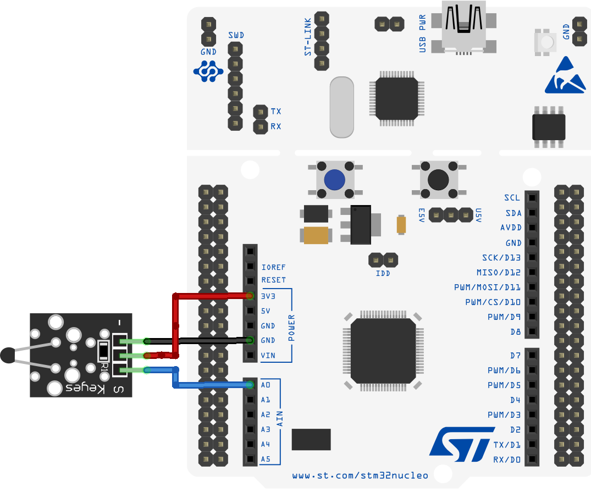

# Nucleo Temperature Measure

## Description

This project implements a real-time data acquisition system for the STM32F446RE Nucleo-64 board. It utilizes hardware-timed ADC sampling triggered by TIM2 and transfers data via DMA to minimize CPU load.

## Prerequisites

To build and run this project, you need:
* **Toolchain**: `gcc-arm-none-eabi`.
* **Build System**: `CMake` (minimum 3.22) and `Ninja`.
* **Hardware Tools**: `OpenOCD` for flashing.
* **Communication**: `minicom` (or similar serial terminal) for telemetry.

## Instructions

### Wiring 



| KY-013 Pin | Nucleo F446RE Pin | Function | Notes |
| :--- | :--- | :--- | :--- |
| **S** (Signal) | **PA0 (A0)** | Analog Input | Connected to ADC1_IN0 |
| **Middle** (+) | **3V3** | Power | Use 3.3V for STM32 logic |
| **-** (GND) | **GND** | Ground | Common ground |


### Instalation

The project uses CMake Presets but is wrapped in a `Makefile` for convenience.

* **Build & Flash**:
  ```bash
  make
  ```
  ### Other Targets

The `Makefile` includes several utility targets for development:

* **`make watch`**: Opens `minicom` to monitor the serial output from the Nucleo board.
* **`make clean`**: Removes the build artifacts from the current build directory.
* **`make fclean`**: Completely removes the build directory.
* **`make re`**: Performs a full re-build (equivalent to `fclean` followed by `make`).

## Algorithm & Mathematics

### 1. Hardware-Timed Sampling & Frequency
The system achieves precise, jitter-free sampling by triggering the ADC using a hardware timer (TIM2) rather than software delays. The sampling frequency ($f_s$) is determined by the APB1 timer clock frequency ($f_{clk}$) and the timer's configuration:

$$f_s = \frac{f_{clk}}{(PSC + 1) \times (ARR + 1)}$$

**Current Configuration:**
* **Clock Source ($f_{clk}$):** 16 MHz (HSI)
* **Prescaler (PSC):** 14
* **Auto-Reload Register (ARR):** 4999

Substituting these values yields the sampling rate:

$$f_s = \frac{16,000,000}{(14 + 1) \times (4999 + 1)} = \frac{16,000,000}{15 \times 5000} = 200.00 \text{ Hz}$$

### 2. Interrupts and DMA Workflow
The data acquisition pipeline is designed for **zero-CPU overhead** during the sampling phase. The process follows this autonomous chain of events:

1.  **Trigger:** TIM2 generates a `TRGO` (Trigger Output) event on every update (overflow).
2.  **Conversion:** The `TRGO` signal signals **ADC1** to start a conversion for Channel 0.
3.  **Transfer:** Upon conversion completion, the **DMA2 Stream 0** controller automatically moves the result from the ADC data register to the `adc_raw_buffer` in SRAM.
4.  **Interrupt:** Only after the DMA fills the buffer (Circular Mode), the `DMA_IT_TC` (Transfer Complete) interrupt fires, calling `HAL_ADC_ConvCpltCallback`.
5.  **Processing:** The CPU wakes up only to set the `sensor_new_data_flag`, allowing the main loop to process/send the data.

### 3. Voltage Calculation
The ADC operates in **12-bit resolution** mode with a reference voltage ($V_{REF}$) of **3.3V**. The raw digital value ($D_{raw}$) is converted to analog voltage ($V_{in}$) using the following equation:

$$V_{in} = D_{raw} \times \frac{V_{REF}}{2^{12} - 1}$$

$$V_{in} = D_{raw} \times \frac{3.3}{4095}$$

## Roadmap

Features planned for implementation:

### Unit Conversion
* **Data Calibration**: Implement Steinhart-Hart equations to convert raw 12-bit ADC voltage values into precise temperature readings in Celsius and Fahrenheit.

### Signal Processing
* **Digital Filtering**: Integrate an Exponentially Weighted Moving Average (EWMA) within the `data_acq.c` module to reduce signal noise from the high-speed sampling.

### Dynamic Analysis
* **Real-time Monitoring**: Implement dynamic analysis of the incoming data stream to track temperature trends and sensor stability during operation.
